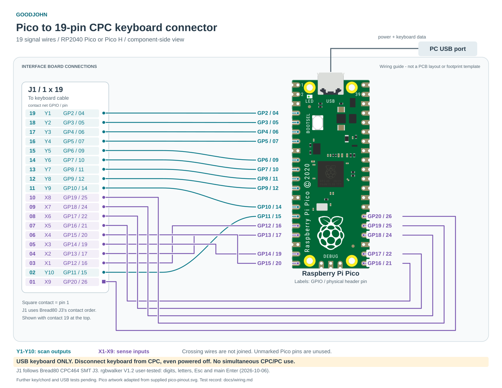

# Goodjohn

Goodjohn is a Raspberry Pi Pico interface for using an Amstrad CPC keyboard as
a USB keyboard on a PC. This repository holds the firmware and the wiring basis
for a future interface PCB.

The first prototype uses an **original RP2040 Pico**, an **English CPC/QWERTY
keyboard**, and **exclusive control of a keyboard disconnected from the CPC
motherboard**. These are the agreed initial requirements. The passive keyboard
connects to Pico GPIO; the Pico's USB connector connects to the PC.

[](docs/wiring.svg)

The drawing's **J1 adapter connector** uses the contact numbering of Bread80's
CPC464 **J3 keyboard connector**. Its square contact 1 is shown at the bottom;
labels give **GPIO / physical Pico pin**. See the [pinout sheet](docs/pinout.pdf)
for connector checks and assembly details.

## Current state

There is a buildable C firmware foundation using the Raspberry Pi Pico SDK and
TinyUSB, plus native tests. It scans the physical 10-by-9 CPC464 wiring, debounces
each contact for 5 ms, and sends standard USB HID boot-keyboard reports. The
default scan period is 1 ms. Reports support six regular keys plus modifiers;
more regular keys produce HID ErrorRollOver until the count falls back to six.

Boards without diodes use conservative ghost suppression: new presses in an
ambiguous rectangle are blocked, while already accepted keys and unrelated keys
continue to work. This cannot recover arbitrary chords or detect a release that
is electrically hidden by other held keys. Fully diode-isolated boards can turn
the filter off at build time.

**Status: host tests pass; basic typing works on rgbwalker V1.2.** On 2026-10-06,
the user confirmed the complete number row (`1234567890`), all three letter rows,
Esc and main Enter with the completed 19-wire direct harness. Replacing the
earlier ribbon/jumper path resolved the incorrect characters using the existing
firmware and pin map. The exact fault in that earlier assembly is still unknown.
See the [staged wiring checks and test record](docs/wiring.md#staged-bring-up-for-rgbwalker-v12).

The remaining individual keys, modifiers, chords, cable timing, and USB
suspend/resume and current still need recorded bench tests. There is no
interface PCB design yet.

## Keyboard projects

| Project | Initial integration |
| --- | --- |
| [rgbwalker's CPC464 Cherry keyboard](https://github.com/rgbwalker/Amstrad_CPC_464_new_Cherry_Keyboard) | V1.2: digits, all letter rows, Esc and main Enter confirmed with a direct 19-wire harness. Further key/chord tests pending; retain ghost suppression. |
| [Bread80 CPC464 SMT mechanical keyboard](https://github.com/Bread80/CPC_Keyboards/tree/main/Keyswitch_CPC464_SMT) | J3 pin map traced from the local KiCad PCB; per-key diodes allow disabling ghost suppression. |
| [Bread80 tactile keyboard](https://github.com/Bread80/CPC_Keyboards/tree/main/Tactile) | Same CPC key arrangement, no diodes; connector adapter still needs checking. |
| [Bread80 CPC6128 SMT keyboard](https://github.com/Bread80/CPC_Keyboards/tree/main/Keyswitch_CPC6128_SMT) | Upstream describes this as a design-stage board; not a validated adapter target. |

Start with [the wiring notes](docs/wiring.md). Connector families are not
interchangeable just because the logical CPC matrix is the same.

For the workbench, use the [ASCII pinout sheet](docs/pinout.txt) or the
[four-page printable PDF](docs/pinout.pdf). These include the Bread80 J3 wire
list, a full Pico header diagram, assembly steps and continuity checks, plus
V1.2 connector orientation and a direct two-wire test for rgbwalker. Regenerate
both with `python3 scripts/generate_pinout.py` after installing
`scripts/requirements-docs.txt` in a Python virtual environment.
Regenerate the README's [SVG wiring diagram](docs/wiring.svg) with
`python3 scripts/generate_wiring_svg.py` in the same environment. It reuses the
Pico artwork from the supplied [pico-pinout.svg](pico-pinout.svg) and the same
firmware-derived wiring data as the sheets.

### Original CPC464 keyboard PCB

The original CPC464 keyboard PCB with the inline 19-wire connection is also
expected to work: its passive switch matrix matches the arrangement targeted
by this firmware, as shown in the
[Amstrad service manual](https://retronik.silicium.org/DOCUMENTS/Info/Amstrad_CPC/Amstrad%20CPC464%20CTM640%20GT64%20Service%20Manual.pdf).
The existing keymap should apply to the English/QWERTY version.

Disconnect the keyboard from the CPC motherboard, even when the CPC is powered
off; the Pico takes over keyboard scanning. Verify your connector's numbering,
orientation and switch continuity against the wiring notes before connecting it.
Keep `GOODJOHN_MATRIX_HAS_DIODES=OFF` (the default), since the original matrix
lacks per-key diodes and needs ghost suppression. Compatibility is expected but
has not yet been tested on original hardware; other connector revisions may
require a different harness.

## Build

Prerequisites: CMake, Make or Ninja, Python 3, an Arm bare-metal GCC toolchain
(`arm-none-eabi-gcc` and `arm-none-eabi-g++`), and the Pico SDK. A native C++
compiler is also needed if the SDK builds picotool instead of using an installed
copy. The development build was checked with SDK **2.2.0**, its pinned TinyUSB
submodule, Arm GNU **14.2.Rel1**, and picotool **2.3.1**.

For an SDK checkout outside this repository:

```sh
git clone --branch 2.2.0 --depth 1 https://github.com/raspberrypi/pico-sdk.git ../pico-sdk
git -C ../pico-sdk submodule update --init --depth 1 lib/tinyusb
cmake -S . -B build -DPICO_SDK_PATH="$(pwd)/../pico-sdk" -DPICO_BOARD=pico -DCMAKE_BUILD_TYPE=Release
cmake --build build --parallel
```

Put the compiler's `bin` directory on `PATH`, or set
`-DPICO_TOOLCHAIN_PATH=/path/to/arm-toolchain`. CMake uses an installed picotool
when available (`-Dpicotool_DIR=/path/to/picotool/cmake-directory`); otherwise the
SDK downloads and builds it, which needs network access.

The output is `build/goodjohn.uf2`. Hold BOOTSEL while connecting the Pico over
USB, then copy the UF2 to its `RPI-RP2` volume. This replaces the existing Pico
application. No hardware has been flashed as part of the initial setup.

For a board with verified diodes on every connected switch:

```sh
cmake -S . -B build -DGOODJOHN_MATRIX_HAS_DIODES=ON
cmake --build build --parallel
```

Leave this option OFF for original membranes, the rgbwalker Cherry board, and
the Bread80 tactile board. Edit `src/board_config.h` to change the GPIO wiring.

The default USB VID/PID (`CAFE:4011`) are development placeholders, not an
assignment to this project. A distributed product needs an authorized pair,
set using `GOODJOHN_USB_VID` and `GOODJOHN_USB_PID` CMake variables.

## Initial key behavior

The keymap sends PC key usages, not CPC character codes. Select the desired PC
keyboard layout in the host OS. Letters and digits follow English QWERTY, but
shifted symbols are not guaranteed to match the CPC legends.

| CPC key | PC behavior |
| --- | --- |
| DEL / CLR | Backspace / forward Delete |
| Main Enter / keypad Enter | Enter / keypad Enter |
| COPY | Left Alt |
| Either Shift | Left Shift (both switches share one matrix contact) |
| CTRL / CAPS LOCK | Left Control / Caps Lock |
| Numeric keypad | PC keypad usages; Num Lock state is controlled by the host |
| `^ £` / `- =` / `@ \|` | PC Equal / Minus / Grave key positions |
| `; +` / `: *` | PC Semicolon / Apostrophe key positions |
| Bread80 bonus switches | Unmapped initially |

There is no Fn layer yet, so F1–F12, GUI and Num Lock have no default bindings.
For early testing, set Num Lock using the PC's existing or on-screen keyboard.
The map lives in `src/keymap.c`; exact CPC symbol translation and additional
layouts are separate follow-up work. Host lock LED reports are accepted, but no
physical lock LEDs or USB remote wakeup are implemented.

## Test without a Pico SDK

```sh
cmake -S . -B build-host -DGOODJOHN_HOST_TESTS=ON
cmake --build build-host
ctest --test-dir build-host --output-on-failure
```

These tests cover contact bounce, independent debounce clocks, timer wrap,
ambiguous chords and recovery, the separate DEL column, modifier reports,
keypad Enter, and six-key overflow/recovery. They do not simulate USB hardware.

## Next hardware milestone

1. Pick the exact keyboard PCB revision and verify the connector with a meter.
2. Wire a Pico prototype and check single keys, modifiers, DEL, both Enter keys,
   press/release bounce and multi-key chords on a PC.
3. Measure scan settling with the intended cable, check suspend/resume and
   reconnect behavior, and settle the missing PC-key bindings.
4. Capture the proven wiring in an interface schematic and PCB with appropriate
   connector orientation, protection and optional lock LEDs.

## References

The adjacent keyboard projects are reference inputs and retain their respective
licenses; no upstream PCB or image assets are copied into this repository.
Exact local revisions and electrical findings are recorded in
[the wiring notes](docs/wiring.md).

Firmware references: [Pico SDK 2.2.0](https://github.com/raspberrypi/pico-sdk/tree/2.2.0),
[Raspberry Pi's USB HID example](https://github.com/raspberrypi/pico-examples/tree/master/usb/device/dev_hid_composite),
[TinyUSB](https://docs.tinyusb.org/), and
[Pico board documentation](https://www.raspberrypi.com/documentation/microcontrollers/pico-series.html).
