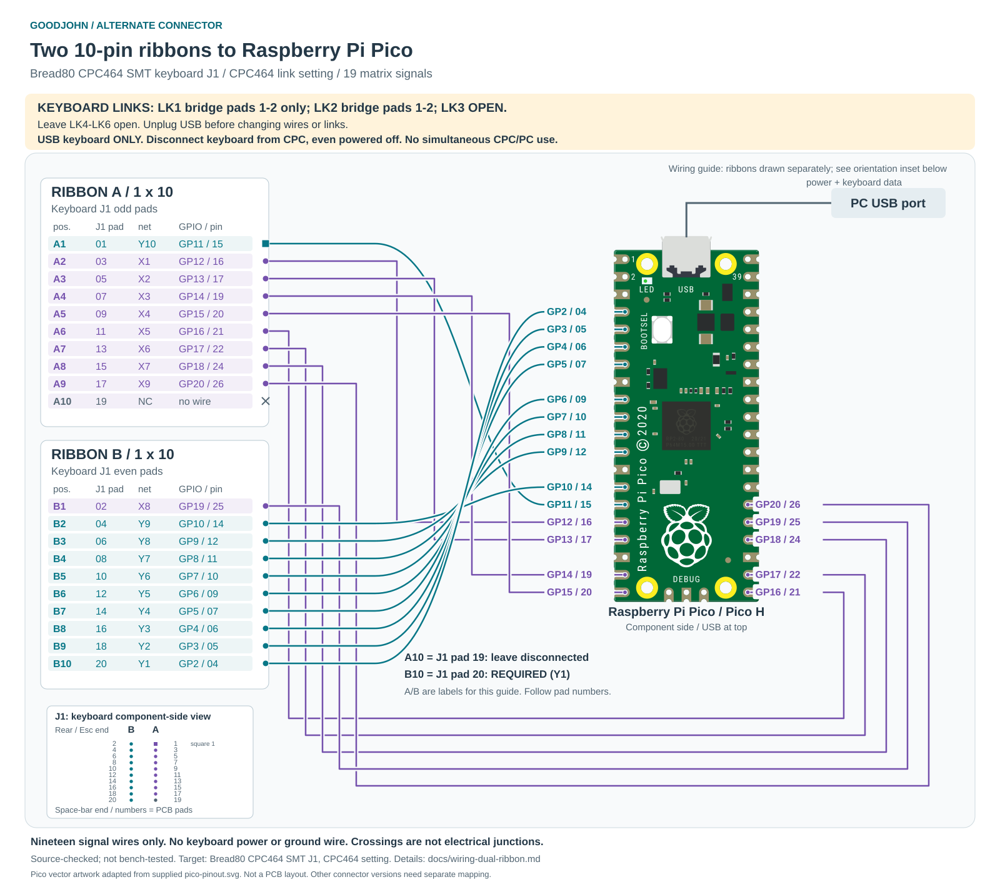

# Bread80 CPC464 SMT: two 10-pin ribbons to Pico

Revision 2 / 2026-10-06. **Source-checked; this J1 harness has not been bench-tested.**
The rgbwalker J3-style harness has its own [hardware test record](wiring.md#hardware-test-record-2026-10-06).

> [!WARNING]
> **USB keyboard use only.** Physically disconnect the keyboard from the CPC
> motherboard, even when the CPC is powered off. **The keyboard cannot operate
> the CPC and PC simultaneously.** There is no pass-through mode; switching the
> CPC off is not enough.

[](wiring-dual-ribbon.svg)

Companions: [ASCII pinout](pinout-dual-ribbon.txt) and [two-page PDF](pinout-dual-ribbon.pdf).

## Exact target and link settings

This scheme is for **Bread80 `Keyswitch_CPC464_SMT`, keyboard connector J1
(Membrane 464/6128), configured for CPC464**, at revision `bf4a6052888fef27ca01a6b0983791d7cb4e8af1`.
J1 has two columns of ten contacts for two 10-way ribbons. These are nineteen
matrix signals plus one unused contact; no matrix power or ground wire is needed.
The Pico is an original RP2040 Pico / Pico H, powered by its USB data connection
to the PC. Disconnect the keyboard from the CPC motherboard entirely.

With USB unplugged, configure the **keyboard PCB** links:

| Link | Required state | Electrical effect |
| --- | --- | --- |
| LK1 | Bridge pads **1-2** only (CPC464 end); pad 3 remains open | J1 pad 2 / B1 connects to X8 |
| LK2 | Bridge pads **1-2** | J1 pad 1 / A1 connects to Y10 |
| LK3 | **Open** | X8 and X9 remain separate |
| LK4, LK5, LK6 | **Open** for initial testing | Bonus switches remain disconnected |

LK1 pad 1 is the square pad on that link. Use pad numbers and verify with a
meter; upstream text/silkscreen contains inconsistent JP/LK references. The
net connections above were checked in the PCB and schematic.

The existing firmware GPIO assignments and keymap apply to this harness.
The conservative diode option OFF can be kept for initial testing. If every
switch diode is fitted and its orientation verified, setting
`GOODJOHN_MATRIX_HAS_DIODES=ON` permits chords that the default ghost filter
would otherwise suppress. No connector-specific firmware remapping is needed.

This table does not cover the CPC6128 link setting, Bread80's J2 modular
connector, the Tactile board's J2/J3, or an original membrane tail whose contact
order has not been verified. On this sheet **J1 means the keyboard connector**;
the J1 in the original [19-pin SVG](wiring.svg) names a proposed adapter instead.

## Connector orientation and numbering

```text
       KEYBOARD COMPONENT SIDE / KEYS FACING YOU
                    Rear / Esc end

           Ribbon B             Ribbon A
              B1 ( 2)          [ 1] A1  square pad
              B2 ( 4)          ( 3) A2
              B3 ( 6)          ( 5) A3
              B4 ( 8)          ( 7) A4
              B5 (10)          ( 9) A5
              B6 (12)          (11) A6
              B7 (14)          (13) A7
              B8 (16)          (15) A8
              B9 (18)          (17) A9
             B10 (20)          (19) A10 -- no connection

                    Space-bar end
       Parenthesized numbers are Bread80 J1 PCB pad numbers.
```

**A and B are labels defined by this guide**, not additional PCB references.
Count A1 and B1 from the same end, next to square J1 pad 1. Ribbon A uses the
**odd** J1 pads; ribbon B uses the **even** pads. A10 is J1 pad **19** and stays
disconnected. B10 is J1 pad **20** and is required for Y1.

Bread80's schematic labels the A ends as original CPC pins 1/10 and the B ends
as 11/20. Those are not the KiCad J1 pad numbers. This guide always distinguishes
ribbon position, J1 PCB pad number, GPIO number and Pico physical pin number.
The solder-side view is mirrored; identify square pad 1 on the actual board.
Check cable continuity even when both ends use identical housings or colors.

## Complete wiring scheme

| Ribbon position | J1 PCB pad | Net | Pico GPIO | Pico physical pin |
| --- | --- | --- | --- | --- |
| A1 | 1 | Y10 | GP11 | 15 |
| A2 | 3 | X1 | GP12 | 16 |
| A3 | 5 | X2 | GP13 | 17 |
| A4 | 7 | X3 | GP14 | 19 |
| A5 | 9 | X4 | GP15 | 20 |
| A6 | 11 | X5 | GP16 | 21 |
| A7 | 13 | X6 | GP17 | 22 |
| A8 | 15 | X7 | GP18 | 24 |
| A9 | 17 | X9 | GP20 | 26 |
| A10 | 19 | NC | -- | Leave disconnected |
| B1 | 2 | X8 | GP19 | 25 |
| B2 | 4 | Y9 | GP10 | 14 |
| B3 | 6 | Y8 | GP9 | 12 |
| B4 | 8 | Y7 | GP8 | 11 |
| B5 | 10 | Y6 | GP7 | 10 |
| B6 | 12 | Y5 | GP6 | 9 |
| B7 | 14 | Y4 | GP5 | 7 |
| B8 | 16 | Y3 | GP4 | 6 |
| B9 | 18 | Y2 | GP3 | 5 |
| B10 | 20 | Y1 | GP2 | 4 |

Only GP2 through GP20 are used. All other Pico header pins stay unconnected
to the keyboard. On a Pico viewed component-side up with USB at the top, physical
pins 1-20 run down the left, and 21-40 run up the right.

## Continuity and staged power-up

1. Disconnect USB and the CPC motherboard. Fit the links above.
2. Verify J1.1 to Y10 (also J3.2), and J1.2 to X8 (also J3.10), each near zero
   ohms without a key held. Verify X8 (J3.10) and X9 (J3.1) are not shorted.
3. Connect A2 / J1.3 to Pico physical 16, and B2 / J1.4 to physical 14. Check
   both individual wires pad-to-pad without holding a key, then connect USB.
   Press top-row `1`; it should type `1`.
4. Unplug USB, add A3 / J1.5 to physical 17, then test `2`. Next add A4 / J1.7
   to physical 19 for Esc. Esc does not print a character.
5. Complete the remaining connections, checking each wire before power-up.
   Test digits, letters, modifiers, both Enter keys, cursor/keypad keys and DEL.
   Test Space and DEL separately to check X8 and the isolated X9/Y10 path.

For switch-pair checks, disconnect the keyboard from the Pico as well. On the
diode board, use diode mode: red probe on X and black probe on Y. Pressed should
conduct in that direction; released should be open. A continuity beeper may not
detect a diode reliably. The Pico pin column below identifies the harness
endpoints; perform these switch-identification measurements on the detached keyboard.

| Key held | Ribbon pair (X / Y) | J1 pads | Pico physical pins |
| --- | --- | --- | --- |
| Top-row 1 | A2 / B2 | 3 / 4 | 16 / 14 |
| Top-row 2 | A3 / B2 | 5 / 4 | 17 / 14 |
| Esc | A4 / B2 | 7 / 4 | 19 / 14 |
| Space | B1 / B5 | 2 / 10 | 25 / 10 |
| Either Shift | A7 / B8 | 13 / 16 | 22 / 6 |
| DEL (Backspace) | A9 / A1 | 17 / 1 | 26 / 15 |
| Main Enter | A4 / B8 | 7 / 16 | 19 / 6 |
| Cursor Up | A2 / B10 | 3 / 20 | 16 / 4 |

## Sources and regeneration

- [Bread80 PCB at the inspected revision](https://github.com/Bread80/CPC_Keyboards/blob/bf4a6052888fef27ca01a6b0983791d7cb4e8af1/Keyswitch_CPC464_SMT/Keyboard.kicad_pcb): J1 pads, connector orientation and LK1-LK6 nets.
- [Matching schematic](https://github.com/Bread80/CPC_Keyboards/blob/bf4a6052888fef27ca01a6b0983791d7cb4e8af1/Keyswitch_CPC464_SMT/Keyboard.kicad_sch): CPC464/CPC6128 routing, ribbon numbering and matrix switch paths.
- `src/board_config.h`: GPIO assignments, shared with the existing firmware.

Install `scripts/requirements-docs.txt`, then run:

```sh
python3 scripts/generate_dual_ribbon.py
```

The generator creates this Markdown scheme, the ASCII/PDF sheets and the SVG
from one connector dataset. Pico vector artwork comes from `pico-pinout.svg`.
