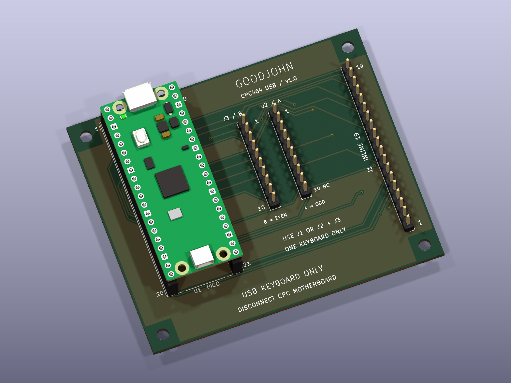

# Goodjohn Pico carrier v1

An **80 × 66 mm, two-layer, hand-solderable carrier** for an original RP2040
Raspberry Pi Pico / Pico H. It replaces the tested direct jumper wiring with
PCB tracks and offers both CPC464 connector arrangements. The existing firmware
and GPIO assignments apply without changes.

**Status: unbuilt prototype.** KiCad 10.0.6 ERC and DRC pass with zero violations,
zero unconnected items and zero schematic parity issues. The actual schematic
and PCB nets also match the firmware and both existing wiring diagrams. This
PCB has not been manufactured or bench-tested; the earlier successful typing
test used a direct harness with rgbwalker V1.2.

> [!WARNING]
> **USB keyboard only. Physically disconnect the keyboard from the CPC
> motherboard, even when the CPC is powered off.** The keyboard cannot operate
> the CPC and PC simultaneously. This carrier has no switching, isolation or
> CPC pass-through circuitry. Connect one keyboard using **J1 OR J2 + J3**.

The image is a KiCad render, not a photograph of manufactured hardware.

## Files to use

- Open [goodjohn-carrier.kicad_pro](goodjohn-carrier.kicad_pro) in **KiCad 10**.
  The [schematic](goodjohn-carrier.kicad_sch), [routed PCB](goodjohn-carrier.kicad_pcb),
  project-local symbol/footprint libraries and library tables are included.
- Read the [schematic PDF](docs/schematic.pdf), [assembly PDF](docs/assembly.pdf),
  [component-side SVG](docs/assembly-top.svg) and [complete connector CSV](docs/connections.csv).
- Prototype manufacturing package:
  [Gerber + drill ZIP](fabrication/goodjohn-carrier-v1-gerbers.zip),
  [individual files](fabrication/gerbers), [fabrication notes](fabrication/README.md).
- [BOM](bom.csv), [pin-map verification](checks/pinmap.json),
  [ERC report](checks/erc.json), [DRC report](checks/drc.json).

## Connections and orientation

All three keyboard headers are ordinary **2.54 mm single-row male headers**.
Use a continuity-checked mating cable or adapter. They are not native FFC/FPC
sockets for inserting a bare original membrane tail.

With the carrier component side facing you and the Pico USB socket at the top:

| Carrier connector | Placement and pin 1 | Keyboard connection |
| --- | --- | --- |
| **U1** | Pico at left; physical pin 1 upper left, pin 40 upper right | Two 1×20 female sockets, rows 17.78 mm apart; USB faces the upper board edge |
| **J1** | 1×19 at right; **pin 1 is at the bottom**, pin 19 at the top | Inline 19-signal pinout: rgbwalker V1.2, Bread80 CPC464 SMT **J3**, original CPC464 PCB-style keyboard |
| **J2 / A** | Right-hand 1×10 ribbon header; **pin 1 at top** | Ribbon A, Bread80 keyboard **J1 odd pads** 1, 3, …, 19 |
| **J3 / B** | Left-hand 1×10 ribbon header; **pin 1 at top** | Ribbon B, Bread80 keyboard **J1 even pads** 2, 4, …, 20 |

Carrier reference names differ from keyboard reference names. **Follow contact
numbers, not apparent left-to-right order, ribbon colors or connector names.**
Match square pad 1 at both ends. The inline carrier header is intentionally
opposite in vertical numbering to the keyboard's Esc-end pin 1; a cable must
still connect contact 1 to contact 1, 2 to 2, and so on.

For Bread80's **two-ribbon J1 connection in CPC464 mode**, bridge keyboard
**LK1 pads 1–2** and **LK2 pads 1–2**; leave **LK3 and bonus links open**.
Carrier **J2.10 / A10 / keyboard J1.19 is unused**.
Carrier **J3.10 / B10 / keyboard J1.20 is required** and carries Y1.
These link settings belong to the keyboard PCB; there are no links to set on
the carrier. For the inline Bread80 J3 connection, retain the original
[inline wiring instructions](../../docs/wiring.md).

On rgbwalker V1.2 the optional twentieth contact is unused. Do not confuse that
contact with Bread80 two-ribbon J1 pad 20. Original keyboard compatibility is
expected from the pinout but has not been bench-tested. CPC6128 and Bread80
Tactile connectors are not validated targets for this carrier.

The 19 contacts carry matrix signals only. No keyboard contact connects to
ground, 3.3 V or 5 V. Ground planes join only the Pico's GND header pins.
Unused Pico GPIO, AGND, VBUS, VSYS, 3V3 and control pins have isolated pads.
The Pico receives power and exchanges data over **one USB data cable to the PC**;
no second USB port or hub is required. This simple carrier adds no input
protection or motherboard isolation; attach the harness with USB unplugged.

## Parts and assembly

The [BOM CSV](bom.csv) specifies generic mechanical requirements rather than
unverified supplier part numbers. Before buying, compare actual connector
drawings and socket height with the supplied footprints and assembly drawing.

| Item | Quantity | Specification |
| --- | ---: | --- |
| Carrier PCB | 1 | Two layers, 1.6 mm FR4, 35 µm / 1 oz copper |
| U1 module | 1 | Original RP2040 Pico with downward male headers, or Pico H; not a bare RP2040 chip |
| U1 sockets | 2 | 1×20 female, vertical, 2.54 mm pitch; 17.78 mm row spacing; nominal 8.5 mm body height |
| J1 | 1 | 1×19 male, vertical, 2.54 mm pitch, 0.64 mm square posts |
| J2, J3 | 2 | 1×10 male, vertical, 2.54 mm pitch, 0.64 mm square posts |
| Mounting hardware | Optional 4 sets | M3 standoffs/screws; 3.2 mm unplated holes; washer/head envelope ≤7 mm |
| Cables | As needed | USB data cable plus one of the two checked keyboard harnesses |

You may leave the unused keyboard connector option unpopulated. Both options
may be soldered, but only one keyboard/harness option should be plugged in.

1. Leave the Pico, keyboard and USB disconnected. Inspect the bare PCB and
   solder U1's two female sockets, keeping them parallel and flush. Fit the
   chosen keyboard headers. Pin 1 is the square pad.
2. With **U1 still removed**, check every cable end to the corresponding Pico
   socket contact using [connections.csv](docs/connections.csv). All 19 paths
   should have continuity. Different matrix nets, matrix-to-GND and
   matrix-to-power pads must remain isolated. A10 must remain isolated too.
3. Check U1 ground contacts 3, 8, 13, 18, 23, 28 and 38 have continuity with
   one another. Confirm there are no shorts between the unused supply pads.
4. Connect the detached keyboard using just one connector option. With USB
   unplugged and the Pico still removed, verify key-operated continuity using
   the table below: it appears only while the indicated key is held. Check
   the complete cable path, not only the keyboard connector.
5. Insert the Pico with its USB socket facing the board's top edge. Flash the
   existing Goodjohn UF2 via BOOTSEL if needed, then use a PC USB data cable.
   Keep ghost suppression enabled (`GOODJOHN_MATRIX_HAS_DIODES=OFF`) unless
   the attached keyboard's diode arrangement has been verified.
6. Record Esc, digits, letters, Enter, Space, DEL, modifiers and chords in a
   text editor. The two-ribbon board and original keyboard still need actual
   hardware validation; record the board version and harness used.

| Key | Inline carrier contacts | Two-ribbon carrier contacts | Pico physical contacts |
| --- | --- | --- | --- |
| Top-row 1 | J1.3 + J1.11 | J2.2 + J3.2 | 16 + 14 |
| Top-row 2 | J1.4 + J1.11 | J2.3 + J3.2 | 17 + 14 |
| Esc | J1.5 + J1.11 | J2.4 + J3.2 | 19 + 14 |
| Main Enter | J1.5 + J1.17 | J2.4 + J3.8 | 19 + 6 |
| Space | J1.10 + J1.14 | J3.1 + J3.5 | 25 + 10 |
| DEL / USB Backspace | J1.1 + J1.2 | J2.9 + J2.1 | 26 + 15 |

Diode-equipped keyboards may require the meter's diode-test mode and correct
probe polarity instead of a continuity beep.

## Mechanical details

Board outline: **80 × 66 mm**, four straight edges, no panelization. Hole
centres measured from the upper-left board corner are **(4,4), (76,4),
(4,62), (76,62) mm**. All four holes are 3.2 mm NPTH; 7 × 7 mm areas around
them exclude tracks, vias and copper pours. This layout has no CPC case fit
claim. Insulate the underside from metalwork and support the board on standoffs.

Pico socket pin 1 is at (10.16, 3.048) mm from that corner; the second socket
row is 17.78 mm to the right. The Pico USB connector faces outwards near the
top edge. Verify the chosen cable plug and socket stack height during the
first physical assembly; the 3D library model is illustrative.

## Editing and rebuilding outputs

The committed `.kicad_sch` and `.kicad_pcb` are the editable design authority.
Use KiCad's normal editors and Update PCB from Schematic for further changes.
Local symbol and footprint libraries make the design independent of sibling
repositories. Standard KiCad 10 3D libraries are needed only for 3D viewing.

See [the hardware tooling instructions](../tools/README.md) for validation,
export and regeneration. Placement was generated with KiCad's Python API and
routed locally with Freerouting **2.5.0**; the final board includes a ground
stitching via at board coordinates (119,120) mm to join a copper strip.
There are 13 vias, all 0.8 / 0.4 mm, and 0.30 mm signal tracks. Minimum design
clearance is 0.25 mm; the router used 0.30 mm. Neither ERC nor DRC suppresses
violations with exclusions.

Pinout provenance and previous bench evidence remain in the repository's
[inline](../../docs/wiring.md) and [two-ribbon](../../docs/wiring-dual-ribbon.md)
notes. Module mechanics come from the
[Raspberry Pi Pico datasheet](https://datasheets.raspberrypi.com/pico/pico-datasheet.pdf)
and the KiCad footprint; [library attribution and changes](libraries/README.md)
are recorded separately. See the [validation record](checks/README.md) for the
checks completed and the remaining physical prototype work.
